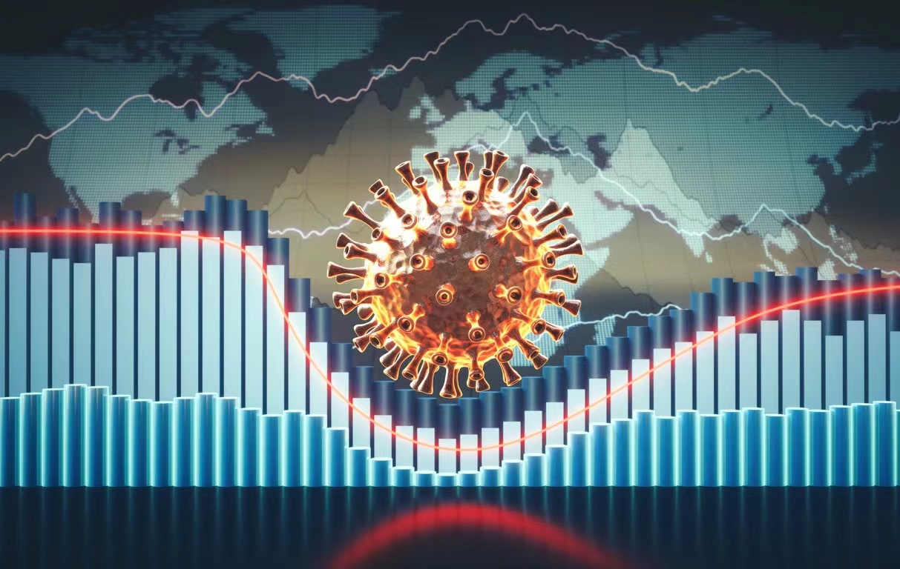

   

\
\

### Project Motivation
The message Americans have been getting about inflation in recent months can be expressed in one word: frightening. Last year, as COVID-19 affected the world economy and disrupted trade flows, which also has had unprecedented effects on all dimensions of human life. Yet, it is certainly not our imagination: groceries do cost more now than prior to pandemic. The increase in food prices that we’ve seen over the past eight months is real and meaningful. According to the U.S. Bureau of Labor Statistics, food prices overall rose about 4.6% since September 2020. 

The effects of pandemic have been felt in almost every sector, and the agricultural market is no different. Our project intends to look deeper into the impact of Covid-19 on agricultural trade and how it's affecting both supply and demand.

 **Contributors: **  
AnMei Chen, Lynn Chen, Xuanhe Chen, Zoey Zhao, Xinyi Zhou 

